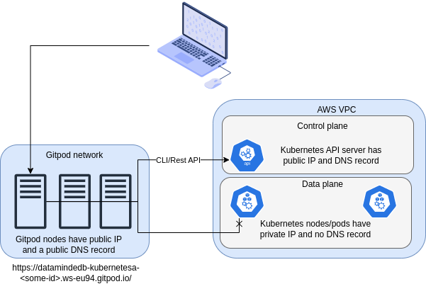

# Services

## Gitpod and Eks network setup

If you are running locally, through microk8s or k3s, you can ignore this section and go straight to the exercise.
In order to troubleshoot some networking issues, it is best to have a look at the network setup when using gitpod with eks.

## Steps

- create a service for the previous deployment
- look up the clusterIP of service
  - go to the homepage to see the content
  - when in gitpod: issue port-forward command to access service locally: `kubectl port-forward service/cat-svc 8080:80` where local port 8080 and service port is 80.
    Now you can go to the ports tab and click on the browser icon next to port 8080.
- change cat index of deployment and do rolling upgrade
- refresh clusterIP multiple times
